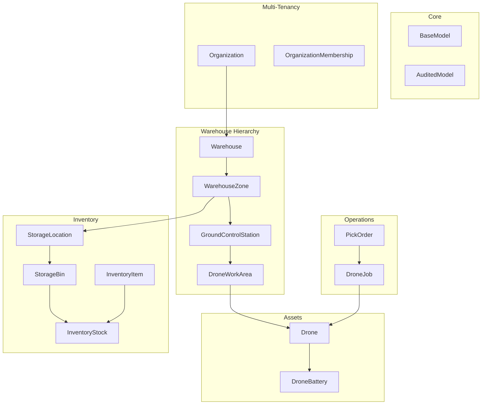

# FlyNG - Model Architecture

> This document defines the complete data model architecture for the FlyNG Warehouse Drone Management System.

## Overview



---

## Entity Relationship Diagram

```mermaid
erDiagram
    %% ==========================================
    %% MULTI-TENANCY & USERS
    %% ==========================================

    Organization ||--o{ OrganizationMembership : has_members
    Organization ||--o{ Warehouse : owns
    Organization ||--o{ OrganizationAPIKey : has

    User ||--o{ OrganizationMembership : belongs_to
    User ||--o{ UserTwoFactorAuth : has
    User ||--o{ UserSession : has
    User ||--o{ UserPasswordHistory : has

    Organization {
        uuid uuid
        string name
        string slug
        string gst_number
        string address
        string city
        string state
        string country
        string postal_code
        string phone
        string email
        image logo
        json settings
        boolean is_active
        datetime created_at
        datetime updated_at
    }

    OrganizationMembership {
        uuid uuid
        int user_id
        int organization_id
        string role
        boolean is_default
        datetime joined_at
        datetime created_at
    }

    User {
        uuid uuid
        string email
        string first_name
        string last_name
        string phone
        string role
        boolean is_verified
        boolean two_factor_enabled
        datetime password_changed_at
        boolean force_password_change
        int failed_login_attempts
        datetime lockout_until
        datetime created_at
        datetime updated_at
    }

    %% ==========================================
    %% WAREHOUSE HIERARCHY
    %% ==========================================

    Warehouse ||--|| WarehouseProfile : has_profile
    Warehouse ||--o{ WarehouseZone : contains
    Warehouse ||--o{ WarehouseContact : has_contacts

    WarehouseZone ||--o{ GroundControlStation : contains
    WarehouseZone ||--o{ StorageLocation : contains

    GroundControlStation ||--o{ DroneWorkArea : manages

    DroneWorkArea ||--o{ Drone : operates

    Warehouse {
        uuid uuid
        int organization_id
        string name
        string code
        string address
        string city
        string state
        string country
        string postal_code
        decimal latitude
        decimal longitude
        string timezone
        json operating_hours
        boolean is_active
        datetime created_at
        datetime updated_at
    }

    WarehouseProfile {
        uuid uuid
        int warehouse_id
        time operating_hours_start
        time operating_hours_end
        boolean is_24x7
        decimal total_area_sqft
        decimal ceiling_height_ft
        int max_drone_capacity
        string measurement_standard
        string currency
        string date_format
        string language
        phone emergency_contact
        decimal safety_clearance_height
        decimal max_flight_speed
        boolean enable_autonomous
        boolean enable_night_ops
        datetime created_at
        datetime updated_at
    }

    WarehouseContact {
        uuid uuid
        int warehouse_id
        string name
        string designation
        encrypted phone
        encrypted email
        boolean is_primary
        boolean is_emergency
        boolean is_active
        text notes
        datetime created_at
        datetime updated_at
    }

    WarehouseZone {
        uuid uuid
        int warehouse_id
        string name
        string code
        text description
        string zone_type
        int floor_level
        decimal area_sqft
        decimal min_x
        decimal max_x
        decimal min_y
        decimal max_y
        int max_drones_allowed
        int priority
        boolean is_active
        boolean is_no_fly_zone
        datetime created_at
        datetime updated_at
    }

    GroundControlStation {
        uuid uuid
        int zone_id
        string name
        string code
        text description
        decimal x_position
        decimal y_position
        decimal z_position
        string hardware_id
        string ip_address
        string firmware_version
        int max_drones
        string status
        datetime last_heartbeat
        boolean is_active
        datetime created_at
        datetime updated_at
    }

    DroneWorkArea {
        uuid uuid
        int ground_control_station_id
        string name
        string code
        text description
        string area_type
        decimal min_x
        decimal max_x
        decimal min_y
        decimal max_y
        decimal min_z
        decimal max_z
        decimal tether_length_m
        decimal tether_anchor_x
        decimal tether_anchor_y
        decimal tether_anchor_z
        decimal max_flight_speed_mps
        int max_drones
        boolean is_active
        datetime created_at
        datetime updated_at
    }

    %% ==========================================
    %% DRONE & BATTERY
    %% ==========================================

    Drone ||--o{ DroneTelemetryLog : generates
    Drone ||--o{ DroneMaintenanceRecord : has
    Drone }o--|| DroneBattery : uses

    DroneBattery ||--o{ BatteryChargingSession : has
    DroneBattery ||--o{ BatterySwapRecord : has

    Drone {
        uuid uuid
        int work_area_id
        int current_battery_id
        string serial_number
        string name
        string model
        string firmware_version
        string status
        decimal home_x
        decimal home_y
        decimal home_z
        datetime last_maintenance
        datetime next_maintenance_due
        int total_flight_hours
        int total_flights
        boolean is_active
        datetime created_at
        datetime updated_at
    }

    DroneTelemetryLog {
        bigint id
        int drone_id
        datetime timestamp
        decimal position_x
        decimal position_y
        decimal position_z
        decimal velocity_x
        decimal velocity_y
        decimal velocity_z
        decimal roll
        decimal pitch
        decimal yaw
        decimal battery_voltage
        decimal battery_percentage
        string flight_mode
        json sensors
    }

    DroneMaintenanceRecord {
        uuid uuid
        int drone_id
        int performed_by_id
        string maintenance_type
        text description
        text notes
        datetime scheduled_at
        datetime completed_at
        int downtime_minutes
        datetime created_at
    }

    DroneBattery {
        uuid uuid
        int organization_id
        string serial_number
        string model
        int capacity_mah
        int cycle_count
        string health_status
        decimal current_voltage
        int current_percentage
        string status
        datetime last_charged_at
        datetime manufactured_at
        boolean is_active
        datetime created_at
        datetime updated_at
    }

    BatteryChargingSession {
        uuid uuid
        int battery_id
        int start_percentage
        int end_percentage
        datetime started_at
        datetime completed_at
        int duration_minutes
        string charger_id
        datetime created_at
    }

    BatterySwapRecord {
        uuid uuid
        int drone_id
        int old_battery_id
        int new_battery_id
        int swapped_by_id
        int old_battery_percentage
        datetime swapped_at
        datetime created_at
    }

    %% ==========================================
    %% INVENTORY SYSTEM
    %% ==========================================

    StorageLocation ||--o{ StorageBin : has

    StorageBin ||--o{ InventoryStock : contains

    InventoryItem ||--o{ InventoryStock : stored_in
    InventoryItem }o--o| ItemCategory : belongs_to

    BinLabelType ||--o{ StorageBinTemplate : used_by
    StorageBinTemplate ||--o{ StorageBin : configures

    StorageLocation {
        uuid uuid
        int zone_id
        string code
        string aisle
        string rack
        string level
        string position
        decimal x_coordinate
        decimal y_coordinate
        decimal z_coordinate
        string location_type
        boolean is_active
        datetime created_at
        datetime updated_at
    }

    BinLabelType {
        uuid uuid
        int organization_id
        string name
        string label_type
        json config
        boolean is_active
        datetime created_at
    }

    StorageBinTemplate {
        uuid uuid
        int organization_id
        int label_type_id
        string name
        decimal width
        decimal height
        decimal depth
        decimal max_weight
        json config
        boolean is_active
        datetime created_at
    }

    StorageBin {
        uuid uuid
        int location_id
        int template_id
        string code
        string label_value
        decimal current_weight
        int item_count
        boolean is_full
        boolean is_active
        datetime created_at
        datetime updated_at
    }

    ItemCategory {
        uuid uuid
        int organization_id
        int parent_id
        string name
        string code
        int level
        boolean is_active
        datetime created_at
    }

    InventoryItem {
        uuid uuid
        int organization_id
        int category_id
        string sku
        string name
        string description
        string barcode
        decimal weight
        decimal length
        decimal width
        decimal height
        decimal unit_price
        string unit_of_measure
        int min_stock_level
        int reorder_point
        image image
        boolean is_active
        datetime created_at
        datetime updated_at
    }

    InventoryStock {
        uuid uuid
        int bin_id
        int item_id
        int quantity
        string lot_number
        datetime expiry_date
        datetime last_counted_at
        datetime created_at
        datetime updated_at
    }

    %% ==========================================
    %% ORDERS & JOBS
    %% ==========================================

    PickOrder ||--o{ PickOrderLine : contains
    PickOrder }o--o| PickOrderBatch : part_of

    PickOrderLine ||--o{ DroneJob : creates

    DroneJob }o--|| Drone : assigned_to
    DroneJob }o--|| StorageBin : source
    DroneJob ||--o{ DroneJobEvent : has

    PickOrderBatch {
        uuid uuid
        int organization_id
        string batch_number
        string status
        int total_orders
        int completed_orders
        datetime created_at
        datetime completed_at
    }

    PickOrder {
        uuid uuid
        int organization_id
        int warehouse_id
        int batch_id
        int created_by_id
        string order_number
        string external_reference
        string order_type
        string status
        string priority
        datetime due_at
        datetime started_at
        datetime completed_at
        text notes
        datetime created_at
        datetime updated_at
    }

    PickOrderLine {
        uuid uuid
        int order_id
        int item_id
        int source_bin_id
        int destination_bin_id
        int requested_quantity
        int picked_quantity
        string status
        datetime created_at
        datetime updated_at
    }

    DroneJob {
        uuid uuid
        int order_item_id
        int drone_id
        int assigned_by_id
        string job_number
        string job_type
        string status
        string priority
        int quantity
        int retry_count
        string failure_reason
        datetime queued_at
        datetime assigned_at
        datetime started_at
        datetime completed_at
        datetime created_at
        datetime updated_at
    }

    DroneJobEvent {
        uuid uuid
        int job_id
        string event_type
        json event_data
        datetime created_at
    }

    %% ==========================================
    %% LOGS & FILES
    %% ==========================================

    DroneFlightLog ||--o{ FlightLogGraph : has

    FlightGraphTemplate ||--o{ FlightLogGraph : applied_to

    DroneFlightLog {
        uuid uuid
        int drone_id
        int uploaded_by_id
        string filename
        string file_path
        int file_size
        string file_type
        datetime flight_date
        int flight_duration
        json metadata
        string status
        datetime processed_at
        datetime created_at
    }

    FlightGraphTemplate {
        uuid uuid
        int organization_id
        int created_by_id
        string name
        string description
        json config
        boolean is_default
        boolean is_active
        datetime created_at
        datetime updated_at
    }

    FlightLogGraph {
        uuid uuid
        int log_file_id
        int template_id
        string name
        json config
        string image_path
        datetime created_at
    }

    %% ==========================================
    %% API & SETTINGS
    %% ==========================================

    OrganizationAPIKey {
        uuid uuid
        int organization_id
        int created_by_id
        string name
        encrypted key_hash
        string prefix
        array scopes
        datetime last_used_at
        datetime expires_at
        boolean is_active
        datetime created_at
    }
```



---

## Model Hierarchy

### Base Classes (from `apps.core.models`)

| Class | Inherits | Fields Added | Use Case |
|-------|----------|--------------|----------|
| `TimeStampedModel` | `Model` | `created_at`, `updated_at` | Basic timestamps |
| `SoftDeleteModel` | `SafeDeleteModel` | `deleted` | Soft delete with cascade |
| `UUIDModel` | `Model` | `uuid` | External API references |
| `BaseModel` | All above | Combined | Most models |
| `AuditedModel` | `BaseModel` | `history` | Critical business data |
| `ReadOnlyModel` | `TimeStampedModel`, `UUIDModel` | - | Immutable records (logs, telemetry) |

### Model Categories

```
├── Multi-Tenancy
│   ├── Organization (AuditedModel)
│   ├── OrganizationMembership (BaseModel)
│   └── OrganizationAPIKey (BaseModel)
│
├── Warehouse Hierarchy
│   ├── Warehouse (AuditedModel) ✅ - translatable: name, description
│   ├── WarehouseProfile (BaseModel) ✅ - settings/config for warehouse
│   ├── WarehouseContact (BaseModel) ✅ - encrypted fields, translatable: designation, notes
│   ├── WarehouseZone (AuditedModel) ✅ - translatable: name, description
│   ├── GroundControlStation (AuditedModel) ✅ - translatable: name, description
│   └── DroneWorkArea (AuditedModel) ✅ - translatable: name, description
│
├── Assets
│   ├── Drone (AuditedModel)
│   ├── DroneTelemetryLog (ReadOnlyModel) - TimescaleDB hypertable
│   ├── DroneMaintenanceRecord (ReadOnlyModel)
│   ├── DroneBattery (AuditedModel)
│   ├── BatteryChargingSession (ReadOnlyModel)
│   └── BatterySwapRecord (ReadOnlyModel)
│
├── Inventory
│   ├── StorageLocation (BaseModel)
│   ├── BinLabelType (BaseModel)
│   ├── StorageBinTemplate (BaseModel)
│   ├── StorageBin (BaseModel)
│   ├── ItemCategory (BaseModel) - self-referential
│   ├── InventoryItem (AuditedModel)
│   └── InventoryStock (AuditedModel)
│
├── Operations
│   ├── PickOrderBatch (BaseModel)
│   ├── PickOrder (AuditedModel)
│   ├── PickOrderLine (AuditedModel)
│   ├── DroneJob (AuditedModel)
│   └── DroneJobEvent (ReadOnlyModel)
│
└── Logs & Files
    ├── DroneFlightLog (BaseModel)
    ├── FlightGraphTemplate (BaseModel)
    └── FlightLogGraph (BaseModel)
```

---

## Apps Structure

```
apps/
├── core/           # Base models, managers, utilities
├── users/          # User, UserSession, UserTwoFactorAuth, UserPasswordHistory
├── organizations/  # Organization, OrganizationMembership, OrganizationAPIKey
├── warehouses/     # Warehouse, WarehouseZone, GroundControlStation, DroneWorkArea
├── drones/         # Drone, DroneTelemetryLog, DroneMaintenanceRecord
├── batteries/      # DroneBattery, BatteryChargingSession, BatterySwapRecord
├── inventory/      # StorageLocation, StorageBin, InventoryItem, InventoryStock
├── orders/         # PickOrder, PickOrderLine, PickOrderBatch
├── jobs/           # DroneJob, DroneJobEvent
└── logs/           # DroneFlightLog, FlightGraphTemplate, FlightLogGraph
```

---

## Model Naming Convention

| Original Short Name | Full Descriptive Name | App |
|---------------------|----------------------|-----|
| `GCS` | `GroundControlStation` | warehouses |
| `WorkArea` | `DroneWorkArea` | warehouses |
| `Zone` | `WarehouseZone` | warehouses |
| `Membership` | `OrganizationMembership` | organizations |
| `APIKey` | `OrganizationAPIKey` | organizations |
| `Telemetry` | `DroneTelemetryLog` | drones |
| `MaintenanceLog` | `DroneMaintenanceRecord` | drones |
| `Battery` | `DroneBattery` | batteries |
| `ChargingSession` | `BatteryChargingSession` | batteries |
| `SwapLog` | `BatterySwapRecord` | batteries |
| `Location` | `StorageLocation` | inventory |
| `Bin` | `StorageBin` | inventory |
| `BinTemplate` | `StorageBinTemplate` | inventory |
| `LabelType` | `BinLabelType` | inventory |
| `Item` | `InventoryItem` | inventory |
| `Inventory` | `InventoryStock` | inventory |
| `Order` | `PickOrder` | orders |
| `OrderItem` | `PickOrderLine` | orders |
| `OrderBatch` | `PickOrderBatch` | orders |
| `Job` | `DroneJob` | jobs |
| `JobEvent` | `DroneJobEvent` | jobs |
| `LogFile` | `DroneFlightLog` | logs |
| `GraphTemplate` | `FlightGraphTemplate` | logs |
| `LogFileGraph` | `FlightLogGraph` | logs |
| `TwoFactorAuth` | `UserTwoFactorAuth` | users |
| `Session` | `UserSession` | users |
| `PasswordHistory` | `UserPasswordHistory` | users |

---

## Special Considerations

### 1. TimescaleDB Hypertable
`DroneTelemetryLog` will use TimescaleDB for time-series optimization:
```python
class DroneTelemetryLog(ReadOnlyModel):
    class Meta:
        # TimescaleDB hypertable
        timescaledb = {
            'time_field': 'timestamp',
            'chunk_time_interval': '1 day',
        }
```

### 2. Encrypted Fields
Sensitive data uses `django-cryptography`:
- `WarehouseContact.phone`
- `WarehouseContact.email`
- `OrganizationAPIKey.key_hash`

### 3. Soft Delete Cascade
Models using `SoftDeleteModel` cascade soft-delete to related objects:
- Organization → Warehouses → WarehouseZones → etc.

### 4. Audit Trail
`AuditedModel` provides full change history via `django-simple-history`:
- Organization, Warehouse, Drone, PickOrder, InventoryStock, etc.

### 5. Model Translation (django-modeltranslation)
Multi-language database content support for user-facing fields (English + Hindi):

| App | Model | Translatable Fields |
|-----|-------|---------------------|
| organizations | `Plan` | name, description |
| organizations | `Organization` | name, description |
| organizations | `OrganizationAPIKey` | name, description |
| warehouses | `Warehouse` | name, description |
| warehouses | `WarehouseContact` | designation, notes |
| warehouses | `WarehouseZone` | name, description |
| warehouses | `GroundControlStation` | name, description |
| warehouses | `DroneWorkArea` | name, description |

Creates database columns like `name_en`, `name_hi` automatically. Configuration in each app's `translation.py`.

---

## Auto-Generated Diagrams

Run these commands to generate diagrams from actual models:

```bash
# All models
python manage.py graph_models -a -o docs/architecture/generated/all_models.png

# Specific apps
python manage.py graph_models organizations warehouses drones -o docs/architecture/generated/core.png

# With grouping
python manage.py graph_models -a -g -o docs/architecture/generated/grouped.png
```

---

## Version History

| Version | Date | Changes |
|---------|------|---------|
| 1.0 | 2026-02-17 | Initial architecture design |
| 1.1 | 2026-02-17 | Renamed all models to full descriptive names |
| 1.2 | 2026-02-18 | Added WarehouseProfile model, django-modeltranslation support (en/hi) |
| 1.3 | 2026-02-18 | Added WarehouseZone, GroundControlStation, DroneWorkArea models |
